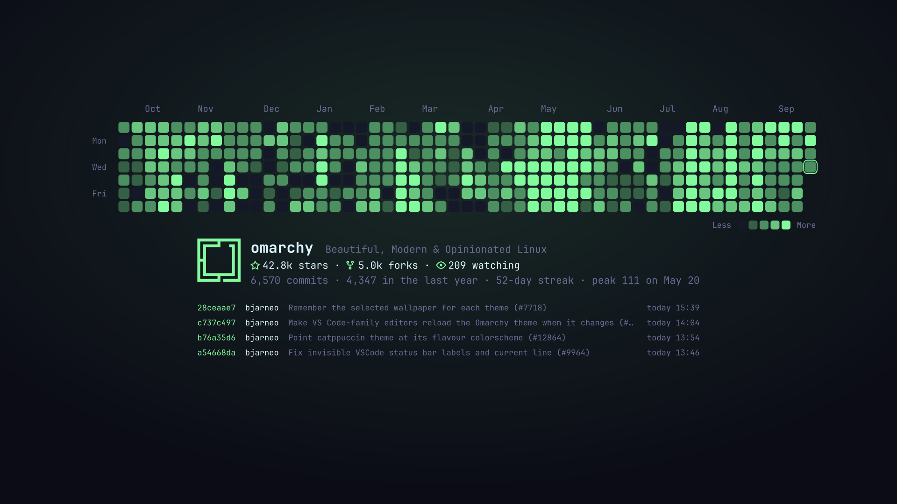

# Commit Wallpaper

A live GitHub contribution-graph wallpaper for [Omarchy](https://omarchy.org), built from the real commit history of [omacom/omarchy](https://github.com/omacom/omarchy) (or any public repo you choose).



- **Themed:** colors come from the active Omarchy theme and are redrawn when you switch themes.
- **Live:** new commits, stars, forks and watchers show up within a few minutes.
- **Animated:** random cells twinkle with a soft glow and today's cell breathes. The animation pauses while windows cover the desktop.
- **Informative:** repo description, stars / forks / watching, all-time and last-year commit counts, current streak, busiest day, and the latest commits (merged PRs are shown by their PR title).

## Install

```bash
omarchy plugin add https://github.com/zenfoco/omarchy-commit-wallpaper.git --enable
```

Enabling the plugin applies the wallpaper right away. It is saved per theme under `~/.config/omarchy/backgrounds/<theme>/` (files named `commit-wallpaper-*.png`), so it also shows up in the background selector.

## How it follows your choices

- **Pick another wallpaper** and the plugin steps aside. It won't take the background back.
- **Pick the commit wallpaper again** from the background selector and it resumes updating.
- **Switch themes** while it is active and it is redrawn in the new theme's colors.

## Configuration

All settings are optional. Create `~/.config/omarchy/commit-wallpaper.json`:

```json
{
  "repo": "omacom/omarchy",
  "refreshMinutes": 5,
  "recentCommits": 4,
  "sparks": 10
}
```

| Key | Default | Meaning |
|---|---|---|
| `repo` | `omacom/omarchy` | Any public GitHub repo, as `owner/name` |
| `refreshMinutes` | `5` | How often to check for new commits and repo stats |
| `recentCommits` | `4` | Recent commits listed under the graph (0 to 10) |
| `sparks` | `10` | Cells twinkling at the same time (0 turns the animation off) |

Changes are picked up automatically.

## How it works

The plugin is a shell `service` with two parts:

- `bin/commit-wallpaper` (Python, standard library only) keeps a commits-only clone of the repo (no trees or blobs) in `~/.cache/io.github.zenfoco.commit-wallpaper/`, reads the commit history, fetches the repo stats from the public GitHub API, renders an SVG with `rsvg-convert`, and applies the PNG with `omarchy-theme-bg-set`.
- `Service.qml` runs the generator on a timer and whenever the background changes. It also draws the animated highlights on a click-through layer above the wallpaper, using the cell positions the generator writes out.

Each check does a single-branch `git fetch` and one conditional API request. An unchanged API response returns `304 Not Modified`, which doesn't count against GitHub's rate limit. The image is only rebuilt when something visible changes. Stars and forks are rounded the way GitHub shows them (`42.8k`), so a new star doesn't trigger a rebuild. When you're offline, the cached data is used.

Remote data is capped, since the repo is configurable: a clone or fetch is killed after 5 minutes or once the cache passes 512 MB (or 2 million commits), and the API response is limited to 1 MB. A failed first clone leaves nothing behind, and a rejected fetch rolls back to the last good history.

Network access: `github.com` (git) and `api.github.com` (repo stats). No tokens, no telemetry. Nothing needs root.

## Dependencies

All of these ship with Omarchy:

- `python` (3.10+)
- `git`
- `librsvg` (`rsvg-convert`)
- `imagemagick` (`magick`, tints the Omarchy logo)
- `ttf-jetbrains-mono-nerd` (star, fork and eye icons)

## Remove

```bash
~/.config/omarchy/plugins/io.github.zenfoco.commit-wallpaper/bin/commit-wallpaper --uninstall
omarchy plugin remove io.github.zenfoco.commit-wallpaper
```

`--uninstall` deletes the generated `commit-wallpaper-*.png` files and the cache. If the commit wallpaper is the current background, it switches back to one of your theme's backgrounds. Nothing else is touched. The optional config file is yours to keep or delete.

## License

MIT
